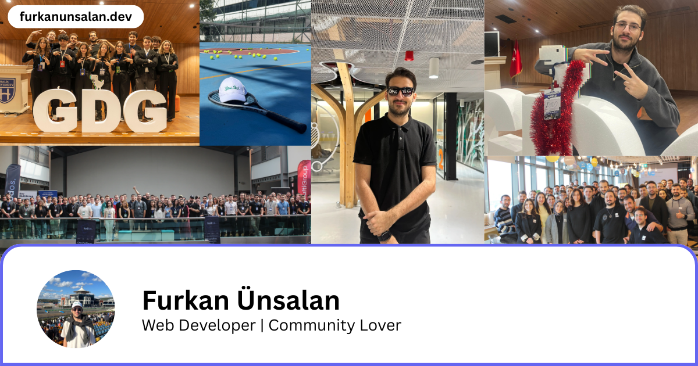

# furkanunsalan.dev

My personal site. Two ways in:

- The web — [furkanunsalan.dev](https://furkanunsalan.dev)
- The terminal — `ssh -p 2222 furkanunsalan.dev` (same content, in a TUI)

## What's here

A small AMOLED-dark Next.js site with a few sections:

- **Home** — short intro, social links, a clock, a "latest" feed across every section, and the gear I use.
- **Experience** — work + volunteering history, with photos and links.
- **Projects** — public GitHub repos by stars, plus a self-hosted contribution heatmap and per-repo README pages.
- **Photos** — masonry gallery pulled from my Unsplash.
- **Bookmarks** — recent saves from Raindrop, split into Posts and Videos.
- **Writing** — long-form posts, Markdoc-rendered, with an RSS feed at `/rss.xml`.

A `/keystatic` admin route is wired up for editing posts, experiences, and tools through a UI — the data lives as plain markdown / JSON files in `content/`, and edits commit straight back to the repo.

## The terminal version

Same data, served over real SSH. Written in Go with [Charm Wish](https://github.com/charmbracelet/wish) + Bubble Tea. Reads the same `content/` files and APIs the web version does, so anything edited in `/keystatic` shows up in both. Connect anonymously, no account, full keyboard or mouse-wheel scrolling. See `terminal/README.md` for details.

## What it talks to

- **GitHub** — repo list, contribution graph, READMEs.
- **Raindrop** — bookmarks.
- **Unsplash** — photos.
- **Keystatic** — content editing.

## Deploys

Self-hosted on a VPS. Two GitHub Actions workflows:

- `deploy.yml` — builds Next.js, rsyncs, reloads PM2.
- `deploy-terminal.yml` — cross-compiles the Go binary, syncs the content folder, idempotently sets up the systemd unit, restarts.

## License & contact

GNU — see [LICENSE](LICENSE). Reach me at `hi@furkanunsalan.dev`.
