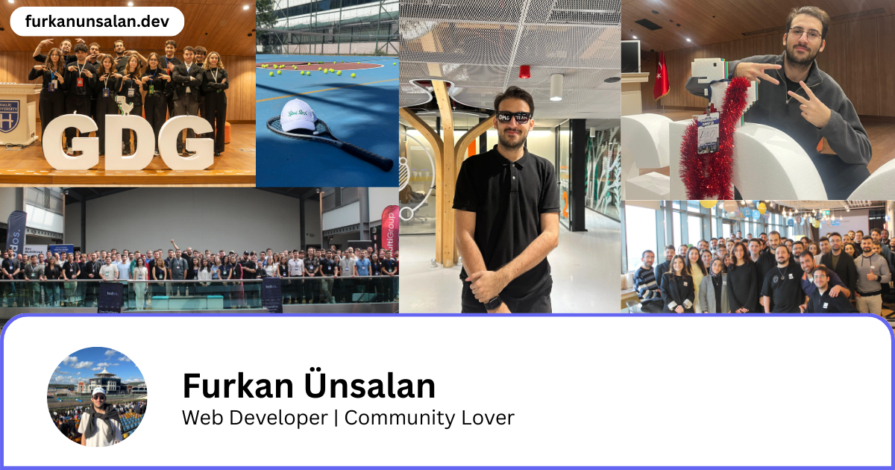
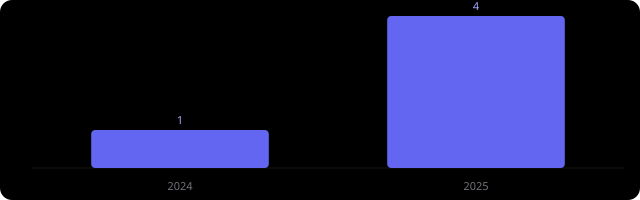
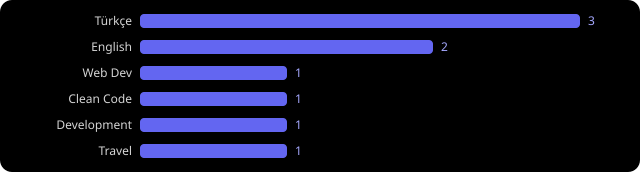

# furkanunsalan.dev

My personal site — an AMOLED-dark Next.js app paired with a terminal SSH twin
that reads the same content directory. Built around a tiny custom CMS
(Keystatic) that commits straight back to this repo.

> Two ways in:
>
> - Web — [furkanunsalan.dev](https://furkanunsalan.dev)
> - Terminal — `ssh -p 2222 furkanunsalan.dev`

## At a glance

| Posts | Experiences |  Tools | Custom projects |
| ----: | ----------: | -----: | --------------: |
| **5** |       **9** | **11** |           **2** |

_Auto-generated on 2026-05-14 from `content/`._

## Posts per year



## Top tags



## Recent writing

- **Contentful ile Blog Sistemi Yönetmek** — 2025-05-18
- **Clean Code 101: Neden ve Nasıl Temiz Kod Yazmalıyız** — 2025-05-11
- **Gezilecek Yerler** — 2025-04-25
- **My Takeaways from Ali Abdaal's Feel Good Productivity** — 2025-02-05
- **Connect Your Docker Apps to a Domain** — 2024-10-22

## Architecture

```
  ┌───────────────────────────────────────────────┐
  │  Next.js 14 App Router  +  Tailwind  +  TypeScript │
  └───────────────────────────────────────────────┘
        │                            │
        │ Reads content/ via Keystatic reader
        ▼                            ▼
  Web (this app)               Terminal (Go + Charm Wish)
        │
        └── GitHub OAuth Keystatic admin at /admin
```

The web app and the terminal app are both clients of one source of truth:
the `content/` directory in this repo. Anything edited through `/admin`
commits straight back to GitHub, so both surfaces stay in sync.

## Technical stack

**Frontend.** Next.js 14.2 App Router with the route group `app/(pages)`
holding all user-facing routes (home, `writing`, `projects`, `photos`,
`experience`, `bookmarks`) and `[slug]` segments for posts and projects.
React 18, TypeScript strict, Tailwind CSS 3.4 with a custom AMOLED palette
(`dark-primary: #000`, accent indigo-500) and `@tailwindcss/typography` for
post bodies. Component primitives come from Radix UI dropdowns, selects, and
tabs wrapped in shadcn-style files under `components/ui/`. Icons are
`lucide-react`; date formatting uses `date-fns` + `date-fns-tz` for the
Istanbul clock on the home page.

**Content & CMS.** Markdoc (`@markdoc/markdoc`) is the authoring format —
post and project bodies live in `content/<collection>/<slug>/index.mdoc`
with YAML frontmatter; experiences and tools are JSON. Keystatic
(`@keystatic/core` + `@keystatic/next`) provides a typed schema, the
`/keystatic` admin UI, and the `createReader` API in `lib/content.ts` that
the pages read at build/runtime. Storage is filesystem-local in dev and
GitHub-backed in production (the admin OAuths against GitHub and commits
back to `main`, triggering the deploy workflow). The two surfaces share
the same schema definition in `keystatic.config.ts`.

**Rendering & data.** Mostly server components with ISR — `export const
revalidate = 3600` on the heavy pages and `generateStaticParams` on
`[slug]` routes so posts and custom projects are baked into the build.
Pages fetch in parallel with `Promise.all` and a `safe()` wrapper that
swallows third-party failures so the home page can render even if Unsplash
or GitHub are down. Markdoc transforms run server-side in
`writing/[slug]/page.tsx` with a custom config that (1) dedupes heading
ids to drive the right-rail `TableOfContents` and (2) collapses runs of
image-only paragraphs into a `PostBentoImages` bento grid. Open Graph
images are generated dynamically per route via `next/og` from a shared
template in `lib/og.tsx` (AMOLED background, indigo glows, title
auto-shrink). An RSS feed is served from `app/rss.xml/route.ts`.

**Backend integrations.** Wrapped per provider under `lib/`:
`github.ts` (REST repos + GraphQL contribution calendar),
`raindrop.ts` (bookmarks + collection stats),
`unsplash.ts` (user photos),
plus the Keystatic reader.
API routes under `app/api/` proxy a few of these to the client where
needed (`/api/github/contributions`, `/api/raindrop`, `/api/raindrop/stats`,
`/api/tools`, and the Keystatic OAuth handler at `/api/keystatic/[...params]`).

**Terminal twin.** `terminal/` is a Go SSH server built on Charm Wish,
Bubble Tea, Lipgloss, and Glamour. It reads the same `content/` directory
and exposes posts, experiences, tools, projects, and bookmarks as a TUI.
Same env vars (`GITHUB_TOKEN`, `RAINDROP_TOKEN`) as the web app. Listens
on :2222.

**Build & deploy.** `output: "standalone"` so Next.js produces a
self-contained server bundle. Husky pre-commit runs `prettier --write` +
`next build` to catch type errors before they hit CI. Two GitHub Actions
pipelines: `deploy.yml` builds the Next.js bundle, rsyncs the standalone
output + `public/` + `content/` to the VPS, and reloads PM2;
`deploy-terminal.yml` cross-compiles the Go binary for Linux and updates
the systemd unit. Nginx fronts both processes on the VPS — `trustHostHeader`
is enabled in `next.config.mjs` so Keystatic's OAuth redirect URI builds
against the public hostname instead of the bind address.

**Analytics & SEO.** Umami pageview script in the root layout, Open Graph
image route per slug, JSON-LD-free metadata via the `Metadata` API, RSS
auto-discovery link, and `robots.txt` defaults to index+follow.

## What it talks to

- **GitHub** — repo list, contribution graph, READMEs.
- **Raindrop** — bookmarks.
- **Unsplash** — photos.
- **Keystatic** — content editing (mounted at `/keystatic`, reachable via `/admin`).

## Deploys

Self-hosted on a VPS, two GitHub Actions workflows:

- `deploy.yml` — builds Next.js, rsyncs, reloads PM2.
- `deploy-terminal.yml` — cross-compiles the Go binary, syncs the content
  folder, idempotently sets up the systemd unit, restarts.

## Regenerating this README

```bash
node scripts/build-readme.mjs
```

## License & contact

GNU — see [LICENSE](LICENSE). Reach me at `me@furkanunsalan.dev`.
