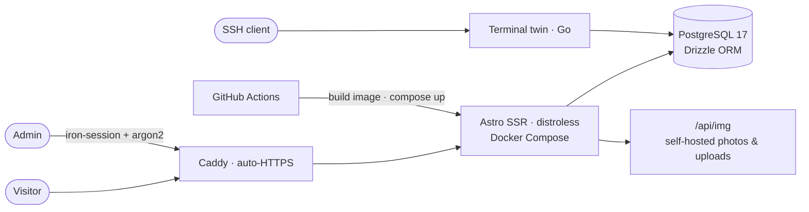

# furkanunsalan.dev

> My corner of the internet, and the little machine that runs it.


Hi, I'm Furkan. This is my personal site: my writing and stray thoughts, the
projects I've built, the experience I've gathered, the gear I use, the photos
I've taken, and the places I've been. It's also a small self-hosted machine I
enjoy tending. Have a look around at [furkanunsalan.dev](https://furkanunsalan.dev).

The whole thing runs off a single VPS with no third-party CMS, no analytics,
and no tracking. Content lives in Postgres and is edited through a custom admin
I built. Even the images are self-hosted.

## What's inside

- **Writing.** Essays and short thoughts, written in Markdoc with a table of
  contents, reading time, and inline [Mermaid](https://mermaid.js.org) diagrams.
- **Projects.** Hand-curated builds plus my public GitHub repos, with commit
  sparklines and a couple of bespoke project pages.
- **Experience.** Roles and communities, grouped by organization.
- **Gadgets.** The gear I use, drawn from a small blueprint-style SVG sketch
  library that I pick from in the admin.
- **Photos.** Self-hosted photography with the EXIF shot data behind each frame.
- **Places.** A self-owned map (Leaflet + Carto) with no Google dependency at
  runtime.
- **Bookmarks.** An Obsidian-style force graph of my saved links and their tags,
  fed from my own [Karakeep](https://karakeep.app) instance.
- **Résumé.** A PDF rendered in-browser, generated from the same database.
- **A terminal twin.** The same content over SSH. Try `ssh -p 2222 furkanunsalan.dev`.

## Architecture


```mermaid
flowchart LR
  visitor([Visitor]) --> caddy["Caddy · auto-HTTPS"]
  admin([Admin]) -->|iron-session + argon2| caddy
  caddy --> web["Astro SSR · distroless<br/>Docker Compose"]
  web --> pg[("PostgreSQL 17<br/>Drizzle ORM")]
  web --> img["/api/img<br/>self-hosted photos & uploads"]
  ssh([SSH client]) --> twin["Terminal twin · Go"]
  twin --> pg
  gh["GitHub Actions"] -->|build image · compose up| web
```

One box, one Caddy in front, everything else on `localhost`. The site is an
Astro SSR server (React components as islands) that ships as a distroless
container and runs, together with its Postgres, as a small Docker Compose stack.
It shares that Postgres with the Go terminal twin, so there is one source of
truth and no second copy to keep in sync. There's a
[full write-up of the self-hosting stack](https://furkanunsalan.dev/writing/self-hosting-on-one-vps)
on the site.

## Under the hood

- **Postgres is the source of truth.** Pages read through `lib/content.ts`
  (Drizzle over postgres-js); the schema lives in `db/schema.ts`.
- **Custom admin CMS** under `/admin/*`, gated by iron-session with an argon2id
  password hash and a rate-limited login.
- **Cached, always-fresh reads.** DB readers go through an in-memory tagged cache
  with per-collection tags; every admin edit busts the right tag, so pages serve
  from cache without hitting Postgres on each view while staying instantly fresh.
- **Fail-soft everywhere.** Every reader degrades to a safe default on a query
  error, so a database blip never takes the whole site down.
- **Self-hosted images.** Uploads are resized to WebP and EXIF-parsed server-side
  with `sharp` + `exifr`, then streamed from a volume outside the image so they
  survive every release.
- **Vercel-free OG images.** Social cards are built as SVG and rasterized with
  `@resvg/resvg-js` using a self-hosted Inter font — no hosted image service.
- **Sane security defaults.** Security headers, a path-traversal-safe image
  server, sanitized DB errors, and no user-uploaded SVGs.
- **Tested and gated.** Vitest unit tests cover the security-critical helpers,
  and CI runs typecheck, tests, and build on every push.

## Tech stack

| Area       | Choice                                          |
| ---------- | ----------------------------------------------- |
| Framework  | Astro 4 (SSR, Node standalone adapter, islands) |
| Language   | TypeScript (strict)                             |
| Data       | PostgreSQL 17 + Drizzle ORM (postgres-js)       |
| Styling    | Tailwind CSS (AMOLED palette)                   |
| Content    | Markdoc + Mermaid                               |
| Auth       | iron-session + argon2id                         |
| Images     | sharp + exifr, served from `/api/img`           |
| OG images  | @resvg/resvg-js (no hosted service)             |
| Validation | zod at the API boundary                         |
| Maps       | Leaflet + Carto                                 |
| Terminal   | Go + Charm Wish / Bubble Tea                    |
| Testing    | Vitest + GitHub Actions CI                      |
| Hosting    | Single VPS, Caddy, Docker Compose (distroless)  |

## Local development

```bash
npm install
npm run dev          # http://localhost:3000
```

`npm run dev` opens an SSH tunnel to the VPS Postgres before starting (the
`predev` step is idempotent). Create a `.env.local` with at least:

```
DATABASE_URL=...            # points at the tunnel in dev
ADMIN_SESSION_SECRET=...    # >= 32 chars
ADMIN_PASSWORD_HASH=...     # argon2id hash (npm run admin:set-password)
VPS_SSH_TARGET=root@...     # dev-only, for the auto-tunnel
```

You can also run the whole stack — app plus Postgres — locally with
`docker compose up --build`. See [`CLAUDE.md`](CLAUDE.md) for the full
environment-variable reference and the conventions this repo follows.

## Testing & CI

```bash
npm test           # vitest
npm run typecheck  # astro check
npm run check      # prettier --check
```

`.github/workflows/ci.yml` runs typecheck, unit tests, and a production build on
every pull request and push.

## Project layout

[`CODEMAP.md`](CODEMAP.md) is the map of where things live;
[`CLAUDE.md`](CLAUDE.md) documents the conventions, environment, and ops
(backups, migrations, deploys). At a glance:

```
src/         Astro pages, layouts, API routes, OG images, middleware
components/  React islands (admin widgets under admin/)
db/          Drizzle schema + generated migrations
lib/         Server helpers: db client, auth, content readers, cache, uploads, OG
terminal/    Go SSH twin (its own module and deploy)
```

## Deploy

Push to `main`. GitHub Actions rsyncs the build context to the VPS and brings up
the Docker Compose stack (`docker compose up -d --build`) — the distroless image
is built on the server, then health-checked. The Go terminal twin ships from its
own workflow to a systemd unit. Uploads, secrets, and the database volume live
outside the rsync target, so deploys never touch them.

## License

[GPL-3.0](LICENSE).
