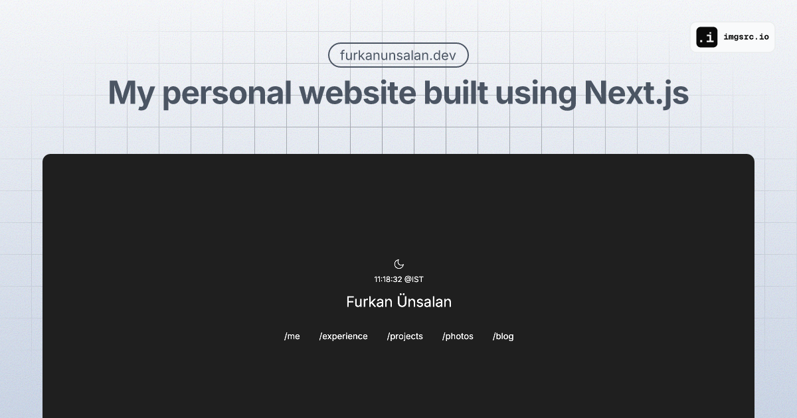

# furkanunsalan.dev
Welcome to the public repository of my personal website. This project includes various components and functionalities for my personal site, including an integration with the Spotify API to display the currently playing track, Unsplash integration for fetching images and more.

## Overview
- `/` — Home page.
- `/me` — You can find information about me in this page.
- `/experience` — My latest volunteering and work experiences.
- `/open-source` — List of all the contributşons I do to open source projects.
- `/projects` — Projects display page for my side projects.
- `/photos` — My favourite photos fetched from Unsplash.
- `/blog` — Where I talk about the stuff I like, mostly tech.
- `/api` — API routes.

## Tech Stack

- [Next.js](https://nextjs.org)
- [Tailwind CSS](https://tailwindcss.com)
- [shadcn/ui](https://ui.shadcn.com)
- [Vercel](https://vercel.com)

## Getting Started

### Prerequisites

- Node.js (version 16.x or later)
- npm or yarn

### Running on Local

```bash
$ git clone https://github.com/furkanunsalan/furkanunsalan.dev.git
$ cd furkanunsalan.dev
$ npm install
$ npm run dev
```

Navigate to `http://localhost:3000` in your browser to see the development server.


### Environment Variables

Create a `.env.local` file in the root of your project and add the following environment variables:
- `UNSPLASH_ACCESS_KEY`: Your Unsplash API access key.
- `SPOTIFY_CLIENT_ID`: Your Spotify Client ID.
- `SPOTIFY_CLIENT_SECRET`: Your Spotify Client Secret.
- `SPOTIFY_REDIRECT_URI`: Your Spotify Redirect URI.
- `SPOTIFY_REFRESH_TOKEN`: Your Spotify Refresh Token.

## Spotify API Integration
For more detailed information on how to integrate with the Spotify API, check out this awesome guide:
[Spotify API with Next.js](https://leerob.io/blog/spotify-api-nextjs)

## Repo Activity


## License
This project is licensed under the MIT License. See the `LICENSE` file for details.
## Contact
If you have any questions, feel free to reach out to me at `me@furkanunsalan.dev`.
